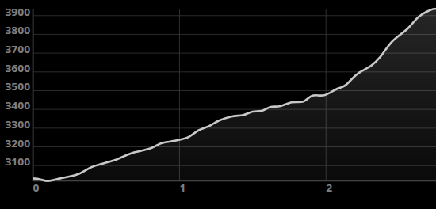

# @snowmap/react-native-svg-graph

Simple yet beautiful SVG line graph

## Installation


```sh
npm install @snowmap/react-native-svg-graph
```


## Usage



```tsx
import {
  Graph,
  XAxis,
  YAxis,
  Grid,
  Lines,
  Pointer,
} from '@snowmap/react-native-svg-graph';
import { useWindowDimensions } from 'react-native';

export default function App() {
  const { width } = useWindowDimensions();

  return (
    <Graph
      values={[distance]}
      width={width}
      height={250}
      zeroVisible={false}
      fontSize={15}
      formatter={(v: number) => `${v} m`}
    >
      <XAxis />
      <YAxis />
      <Grid
        axis={'y'}
        position={'top'}
        type={'value'}
        strokeWidth={1}
        stroke={'rgb(50,50,50)'}
        formatter={(v: number) => `${v}`}
      />
      <Grid
        axis={'x'}
        type={'value'}
        position={'bottom'}
        strokeWidth={1}
        stroke={'rgb(50,50,50)'}
        formatter={(v: number) => `${v}`}
      />
      <Lines
        colors={[
          {
            positiveColor: 'rgba(200, 200, 200, 1)',
            negativeColor: 'rgba(200, 200, 200, 1)',
          },
        ]}
      />
      <Pointer />
    </Graph>
  );
}

const distance: [number, number][] = [
  [0, 3031.69],
  [0.09974762120007619, 3018.81],
  [0.1816576027841027, 3030.73],
  [0.3032180057571011, 3053.01],
  [0.3995103611079862, 3092.11],
  [0.48473631019974606, 3112.72],
  [0.5630607557231183, 3130.6],
  [0.6658650650781975, 3164.63],
  [0.7495125006091281, 3180.73],
  [0.811016955433325, 3194.82],
  [0.8788030284255292, 3219.94],
  [0.9409674393655216, 3228.74],
  [1.0007140924409288, 3237.73],
  [1.061746731345835, 3252.44],
  [1.1318921906569006, 3288.77],
  [1.2032804234364305, 3311.63],
  [1.270351963546514, 3340.75],
  [1.3538758211058444, 3361.73],
  [1.435743531028339, 3370.45],
  [1.4978859992910007, 3387.65],
  [1.5595449982007665, 3391.75],
  [1.6225730581739959, 3413.15],
  [1.6830361643279836, 3416.45],
  [1.76388516657341, 3437.42],
  [1.844934388415891, 3442.05],
  [1.90723059643898, 3473.74],
  [1.9886135803297953, 3475.75],
  [2.069535933978599, 3507.45],
  [2.13061378505066, 3527.75],
  [2.2105119042361228, 3586.76],
  [2.3111384288856214, 3634.76],
  [2.3685569919279144, 3678.46],
  [2.4505473927626023, 3761.47],
  [2.5556831728582536, 3829.47],
  [2.629448175668342, 3891.77],
  [2.695866786557611, 3924.17],
  [2.756209365790899, 3936.77],
];
```


## Contributing

- [Development workflow](CONTRIBUTING.md#development-workflow)
- [Sending a pull request](CONTRIBUTING.md#sending-a-pull-request)
- [Code of conduct](CODE_OF_CONDUCT.md)

## License

MIT

---

Made with [create-react-native-library](https://github.com/callstack/react-native-builder-bob)
